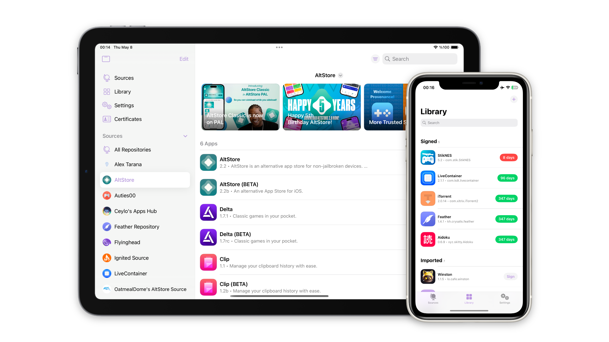

# Feather

This app allows you to install and manage applications contained in a single app, using certificate pairs and various installation techniques to allow apps to install to your device. This is an entirely stock application and uses built-in features to be able to do this!

<picture><source media="(prefers-color-scheme: dark)" srcset="Images/Image-dark.png"><source media="(prefers-color-scheme: light)" srcset="Images/Image-light.png"></picture>

## Features
- User friendly, and clean UI.
- Sign and install applications.
- Supports [AltStore](https://faq.altstore.io/distribute-your-apps/make-a-source#apps) repositories.
- View detailed information about apps and your certificates.
- Configurable signing options mainly for modifying the app, such as appearance and allowing support for the files app.
  - This includes patching apps for compatibility and Liquid Glass.
- Tweak support for advanced users, using [Ellekit](https://github.com/tealbathingsuit/ellekit) for injection. 
  - Supports injecting `.deb` and `.dylib` files.
- Actively maintained: always ensuring most apps get installed properly.
- No tracking or analytics, ensuring user privacy.
- Of course, open source and free.

## How does it work?

How Feather works is a bit complicated, with having multiple ways to install, app management, tweaks, etc. However, I'll point out how the important features work here.

To start off, we need a validly signed IPA. We can achieve this with Zsign, using a provided IPA using a `.p12` and `.mobileprovision` pair.

#### Install (Server)
- Use a locally hosted server for hosting the IPA files used for installation, including other assets such as icons, etc. 
  - On iOS 18, we need a few entitlements: `Associated Domains`, `Custom Network Protocol`, `MDM Managed Associated Domains`, `Network Extensions`
- Make sure to include valid https SSL certificates as the next URL requires a valid HTTPS connection, for us we use [*.backloop.dev](https://backloop.dev/).
- We then use `itms-services://?action=download-manifest&url=<PLIST_URL>` to attempt to initiate an install, by using `UIApplication.open`.

However, due to the changes with iOS 18 with entitlements we will need to provide an alternative way of installing. We have two options here, a way to install locally fully using the local server (the one I have just shown) or use an external HTTPS server that serves as our middle man for our `PLIST_URL`, while having the files still local to us. Lets show the latter.

- This time, lets not include https SSL certificates, rather just have a plain insecure local server.
- Instead of a locally hosting our `PLIST_URL`, we use [plistserver](https://github.com/nekohaxx/plistserver) to host a server online specifically for retrieving it. This still requires a valid HTTPS connection.
- Now, to even initiate the install (due to lack of entitlements from the former) we need to trick iOS into opening the `itms-services://` URL, we can do this by summoning a Safari webview to a locally hosted HTML page with a script to forcefully redirect us to that itms-services URL.

Since itms-services initiates the install automatically, we don't need to do anything extra after the process. Though, what we do is monitor the streaming progress of the IPA being sent.

#### Install (Pairing)
- Establish a heartbeat with a TCP provider (the app will need this for later).
  - For it to be successful, we need a [pairing file](https://github.com/jkcoxson/idevice_pair) and a [VPN](https://apps.apple.com/us/app/stosvpn/id6744003051).
- Once we have these and the connection was successfully established, we can move on to the installation part.
  - Before installing, we need to check for the connection to the socket that has been created, routed to `10.7.0.1`, if this succeeds we're ready.
- When preparing for installation, we need to establish another connection but for `AFC` using the TCP provider.
- Once the connection was established we need to created a staging directory to `/PublicStaging/` and upload our IPA there.
- Then, using our connection to `AFC` we can command it to install that IPA directly. Similar to `ideviceinstaller`, but fully on your phone.

Due to how it works right now we need both a VPN and a lockdownd pairing file, this means you will need a computer for its initial setup. Though, if you don't want to do these you can just use the server way of installing instead (but at a cost of less reliability). 

## Download

Visit [releases](https://github.com/khcrysalis/Feather/releases) and get the latest `.ipa`.

## Contributing

Read the [contribution requirements](./CONTRIBUTING.md) for more information.

## Sponsors

| Thanks to all my [sponsors](https://github.com/sponsors/khcrysalis)!! |
|:-:|
|  |
| _**"samara is cute" - Vendicated**_ |

## Star History

<a href="https://star-history.com/#khcrysalis/feather&Date">
 <picture>
   <source media="(prefers-color-scheme: dark)" srcset="https://api.star-history.com/svg?repos=khcrysalis/feather&type=Date&theme=dark" />
   <source media="(prefers-color-scheme: light)" srcset="https://api.star-history.com/svg?repos=khcrysalis/feather&type=Date" />
   
 </picture>
</a>

## Acknowledgements

- [Samara](https://github.com/khcrysalis) - The maker
- [idevice](https://github.com/jkcoxson/idevice) - Backend for builds with this included, used for communication with `installd`.
- [*.backloop.dev](https://backloop.dev/) - localhost with public CA signed SSL certificate
- [Vapor](https://github.com/vapor/vapor) - A server-side Swift HTTP web framework.
- [Zsign](https://github.com/zhlynn/zsign) - Allowing to sign on-device, reimplimented to work on other platforms such as iOS.
- [LiveContainer](https://github.com/LiveContainer/LiveContainer) - Fixes/some help
- [Nuke](https://github.com/kean/Nuke) - Image caching.
- [Asspp](https://github.com/Lakr233/Asspp) - Some code for setting up the http server.
- [plistserver](https://github.com/nekohaxx/plistserver) - Hosted on https://api.palera.in.

## License 

This project is licensed under the GPL-3.0 license. You can see the full details of the license [here](https://github.com/khcrysalis/Feather/blob/main/LICENSE). It's under this specific license because I wanted to make a project that is transparent to the user thats related to certificate paired sideloading, before this project there weren't any open source projects that filled in this gap.

By contributing to this project, you agree to license your code under the GPL-3.0 license as well (including agreeing to license exceptions), ensuring that your work, like all other contributions, remains freely accessible and open.

## Disclaimer

This project is maintained here, on GitHub. Releases are distributed here, on GitHub. We do not currently have a project website outside of this repository. Please make sure to avoid any sites that host our software as they are often malicious and are there to mislead to user.
