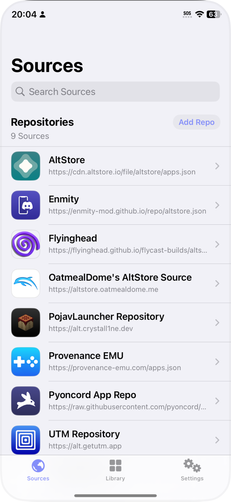
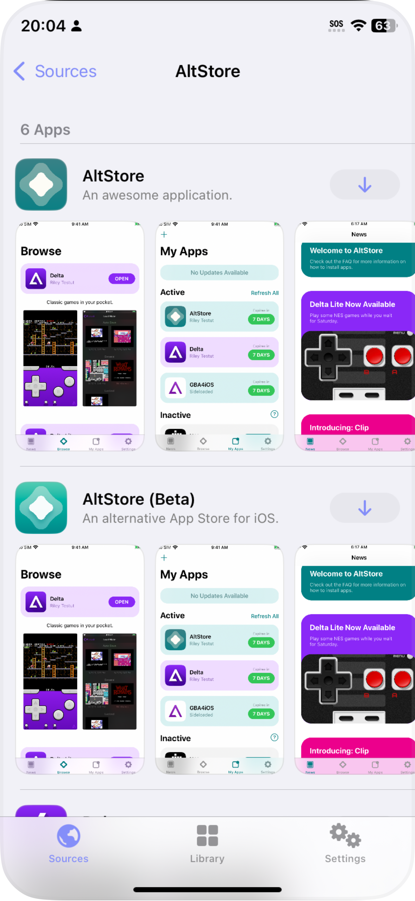
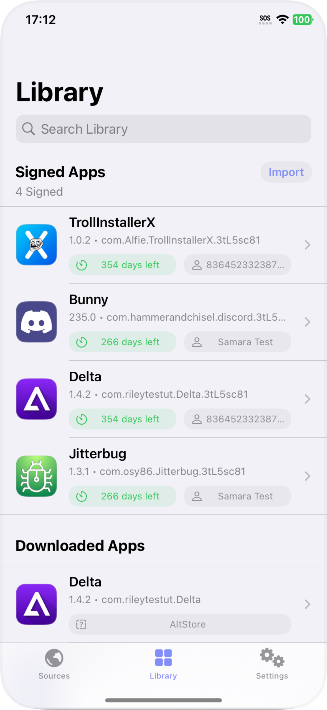
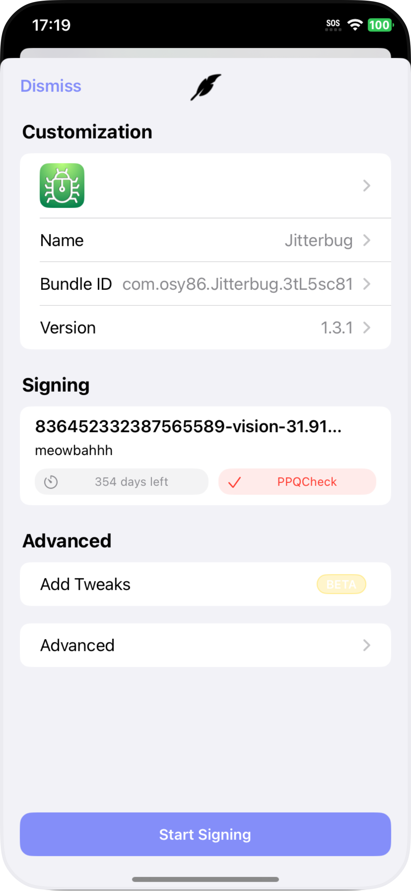

<div align="center">
    
</div>
<h1>Feather (Pióro)</h1>
<p>
    Feather to darmowy menedżer/instalator aplikacji na urządzenia iOS, stworzony z użyciem UIKit dla jakości.
</p>

#### README W Innych Językach

- [English🌐](https://github.com/khcrysalis/Feather/blob/main/README.md)
- [Deutsch🇩🇪](https://github.com/khcrysalis/Feather/blob/main/README_de.md)
- [Русский🇷🇺](https://github.com/khcrysalis/Feather/blob/main/README_ru.md)

## Funkcje

- **Wsparcie dla repozytoriów Altstore**. *Wsparcie dla struktury repozytoriów Legacy i 2.0*
- **Importuj własne `.ipa`**.
- **Wstrzykuj tweaky podczas podpisywania aplikacji**.
- **Instaluj aplikacje bezpośrednio na swoje urządzenie bezproblemowo, over-the-air**.
- **Pozwala na importowanie wielu certyfikatów dla łatwego przełączania**.
- **Konfigurowalne opcje podpisywania**. *(nazwa, bundleid, wersja, inne opcje plist)*
- **Przeznaczone do użycia z kontami Apple będącymi częścią `ADP` (Apple Developer Program)**. *jednak inne certyfikaty również mogą działać!*
- **Łatwe ponowne podpisywanie**! *Jeśli masz inny certyfikat, którego chciałbyś użyć do aplikacji, możesz ponownie podpisać i ponownie zainstalować tę samą aplikację!*
- **Brak śledzenia, analityki ani niczego w tym rodzaju**. *Twoje informacje, takie jak UDID i certyfikaty, nigdy nie opuszczą urządzenia.*

> [!WAŻNE]
> **Wsparcie dla tweaków jest w wersji beta**, upewnij się, że Twoje poprawki działają na platformie podłączeniowej [Ellekit](https://theapplewiki.com/wiki/ElleKit) i są stworzone w najnowszej wersji theos.
> 
> **Niektóre poprawki, nie wszystkie, powinny działać z Feather.** Jednak nie oczekuj, że poprawki będą działać od razu. Nie zmienimy żadnego polecenia ładowania dylib, które nie jest z CydiaSubstrate.

## Linki
 → [Odwiedź Wiki Feather tutaj!](https://github.com/khcrysalis/Feather/wiki)\
 → [Odwiedź Plany tutaj!](https://github.com/khcrysalis/Feather/issues/26)

## Zrzuty ekranu

| <p align="center"><picture><source media="(prefers-color-scheme: dark)" srcset="Images/Repos.png"><source media="(prefers-color-scheme: light)" srcset="Images/Repos_L.png"></picture></p> | <p align="center"><picture><source media="(prefers-color-scheme: dark)" srcset="Images/Store.png"><source media="(prefers-color-scheme: light)" srcset="Images/Store_L.png"></picture></p> | <p align="center"><picture><source media="(prefers-color-scheme: dark)" srcset="Images/Library.png"><source media="(prefers-color-scheme: light)" srcset="Images/Library_L.png"></picture></p> | <p align="center"><picture><source media="(prefers-color-scheme: dark)" srcset="Images/Sign.png"><source media="(prefers-color-scheme: light)" srcset="Images/Sign_L.png"></picture></p> |
|:--:|:--:|:--:|:--:|
| **Źródła** | **Sklep** | **Biblioteka** | **Podpisywanie** |
> [!Tip]
> Przełącz się na tryb jasny, aby zobaczyć zrzuty ekranu w trybie jasnym!

## Jak to działa

Feather pozwala na import pary `.p12` i `.mobileprovision`, aby podpisać aplikację (będziesz potrzebować poprawnego hasła do p12 przed importem). [Zsign](https://github.com/zhlynn/zsign) jest używany do aspektu podpisywania, Pióro przekazuje mu certyfikaty wybrane w jego zakładce certyfikatów i podpisuje aplikację na Twoim urządzeniu - po zakończeniu zostanie dodana do zakładki podpisanych aplikacji. Po wybraniu zajmie to chwilę, ponieważ kompresuje i poprosi Cię o instalację.

## FAQ

> Czego Feather używa do swojego serwera?

Używa certyfikatu [localhost.direct](https://github.com/Upinel/localhost.direct) oraz [Vapor](https://github.com/vapor/vapor), aby samodzielnie hostować serwer HTTPS na Twoim urządzeniu - wszystkie usługi itms naprawdę potrzebują ważnego certyfikatu i ważnego serwera HTTPS. Co pozwala iOS zaakceptować żądanie i zainstalować aplikację.

> Czy Feather bundluje swój własny certyfikat dla serwera?

Tak, aby móc instalować aplikacje na urządzeniu, serwer musi być HTTPS. Używamy certyfikatu localhost.direct podczas uruchamiania serwera podczas próby instalacji.

Mamy opcję pobrania nowego certyfikatu, aby ten serwer mógł działać w dalekiej przyszłości, ale nie ma gwarancji. Całkowicie zależy to od właścicieli localhost.direct, aby móc dostarczyć certyfikat do użytku. Jeśli wygasa i dostępny jest nowy, miejmy nadzieję, że będziemy tam, aby zaktualizować pliki w tle, aby Feather mogło je pobrać.

> Dlaczego Pióro dodaje losowy ciąg do identyfikatora pakietu?

Nowe członkostwa ADP (Apple Developer Program) utworzone po 6 czerwca 2021 roku wymagają od aplikacji podpisanych w trybie dewelopera i ad-hoc dla iOS, iPadOS oraz tvOS sprawdzenia z usługą PPQ (Provisioning Profile Query Check) podczas pierwszego uruchomienia aplikacji. Urządzenie musi być podłączone do internetu w celu weryfikacji.

PPQCheck sprawdza podobny identyfikator pakietu w App Store; jeśli ten identyfikator pasuje do uruchamianej aplikacji i jest podpisany certyfikatem innym niż App Store, Twój identyfikator Apple może zostać oznaczony lub nawet zablokowany na dłużej.

Dlatego dodajemy losowy ciąg przed każdym identyfikatorem; jest to środek ostrożności - jednak możesz go wyłączyć, jeśli *naprawdę* chcesz w ustawieniach Feather.

*UWAGA: JEŚLI CHCESZ ZACHOWAĆ DANE APLIKACJI PODCZAS REINSTALACJI, UPEWNIJ SIĘ, ŻE MASZ TEN SAM BUNDLEID.*

> Co to jest usunięcie dylib wewnątrz opcji?

Jest ku temu bardzo konkretny powód; dla tych chcących usunąć wcześniej wstrzyknięte dyliby wewnątrz, ale naprawdę nie ma innego praktycznego zastosowania poza tym. Nie używaj tego, jeśli nie masz pojęcia co robisz.

> Co z darmowymi kontami dewelopera?

Niestety Feather prawdopodobnie nigdy nie będzie wspierać tych kont, ponieważ istnieje wiele alternatyw! Oto kilka: [Altstore](https://altstore.io), [Sideloadly](https://sideloadly.io/) 

## Budowanie

```sh
git clone https://github.com/khcrysalis/feather # Klonuj
cd feather
make package SCHEME="'feather (Release)'" # Buduj
```
> [!Tip]
> Użyj `SCHEME="'feather (Debug)'"` dla budowy debug

## Sponsorzy

| Dziękuję wszystkim moim [sponsorom](https://github.com/sponsors/khcrysalis)!! |
|:-:|
|  |
| _**"samara jest urocza" - Vendicated**_ |

## Historia Gwiazdek

<a href="https://star-history.com/#khcrysalis/feather&Date">
 <picture>
   <source media="(prefers-color-scheme: dark)" srcset="https://api.star-history.com/svg?repos=khcrysalis/feather&type=Date&theme=dark" />
   <source media="(prefers-color-scheme: light)" srcset="https://api.star-history.com/svg?repos=khcrysalis/feather&type=Date" />
   
 </picture>
</a>

## Podziękowania

- [localhost.direct](https://github.com/Upinel/localhost.direct) - localhost z publicznym certyfikatem SSL
- [Vapor](https://github.com/vapor/vapor) - Framework HTTP po stronie serwera napisany w Swift.
- [Zsign](https://github.com/zhlynn/zsign) - Umożliwiający podpisywanie na urządzeniu; zaimplementowany ponownie do pracy na innych platformach takich jak iOS.
- [Nuke](https://github.com/kean/Nuke) - Buforowanie obrazów.
- [Asspp](https://github.com/Lakr233/Asspp) - Niektóre kody do skonfigurowania serwera http.

## Wkłady

Są mile widziane! :)

Citations:
[1] https://onejailbreak.com/blog/feather-ipa-installer/
[2] https://www.instructables.com/IOS-App-for-Adafruit-Feather-NRF52832/
[3] https://apps.apple.com/us/app/feather-for-mastodon/id6446263061
[4] https://feathermc.com
[5] https://github.com/khcrysalis/Feather/blob/main/README.md
[6] https://www.youtube.com/watch?v=TMW8Za2_HqM
[7] https://twitter.com/khcrysalis/status/1827431025678635136
[8] https://apps.apple.com/id/app/sg-project-feather/id6468328671?mt=12
